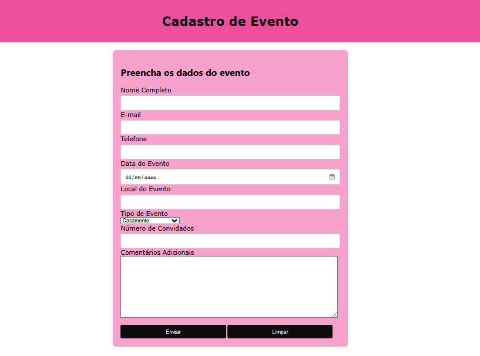

# cadastro-evento
Projeto variado como parte avaliativa de discipina de Fundamentos de Denvolvimentos ministrada pelo professor Leonardo Rocha
 
## índice
* [Descrição](#descrição)
* [Resultado do projeto](#resultado-do-projeto)
* [Propriedades ultilizadas](#propriedades-ultilizadas)
* [Elementos html ultilizados](#elementos-html-ultilizados)
* [Tecnologias](#tecnologias)
* [Estilização](#estilização)
* [Referência](#rêferências)
* [Autor(a)](#autora)
 
## Descrição
 
Nesse projeto foi criado uma página para cadastro de eventos.

## Resultado do projeto

A imagem abaixo é o resultado final da página onde você deve colocar os dados do evento que você deseja organizar.



## Propriedades ultilizadas
 
* padding - define a área de preenchimento em todos os quatro lados de um elemento de uma só vez.
 
* background -  é um atalho para definir os valores de fundo individuais em um único lugar na folha de estilo. 
 
* font-family - ultilizado para escolher a fonte das letras.
 
* width -  determina a largura da área de conteúdo de um elemento. A área de conteúdo fica dentro do preenchimento, da borda, e da margem de um elemento.
 
* border-radius - deixa as bordas do container arredondadas.
 
* text-align - ultilizado para centralizar o texto.

* margin - define a área de margem nos quatro lados do elemento.

* color -  definine o valor da cor de um elemento com seu conteúdo em texto e seus decorações (estilos).

* max-width - estabelece a largura máxima de um elemento.

* box-sizing -  é utilizada para alterar a propriedade padrão da box model, usada para calcular larguras (widths) e alturas (heights) dos elementos.

* box-shadow - é utilizado para adicionar efeitos de sombra em volta de um elemento.

* margin-top -  indica o espaço acima do elemento.

* border - para estilizar a borda.

* cursor -  especifica o cursor do mouse mostrado quando o ponteiro do mouse está sobre um elemento.

## Elementos html ultilizados

* main - representa o conteúdo dominante do <corpo> de um documento.

* form - representa uma seção de documento que contém controles interativos para enviar informações.

* label - representa uma legenda para um item em uma interface do usuário.

* input -  usado para criar controles interativos para formulários baseados na Web para aceitar dados do usuário; Uma ampla variedade de tipos de dados de entrada e widgets de controle estão disponíveis, dependendo do dispositivo e do agente do usuário.

* button - é um elemento interativo ativado por um usuário com um mouse, teclado, dedo, comando de voz ou outra tecnologia assistiva.

* header - representa um grupo de suporte introdutório ou navegacional.

* textarea - representa um controle de edição para uma caixa de texto, útil quando você quer permitir ao usuário informar um texto extenso em formato livre, como um comentário ou formulário de retorno.

## Estilização
 
* O projeto foi estilizado ultilizando o arquivo style.css.

```
header {
    background: rgb(236, 79, 158);
    color: rgb(7, 7, 7);
    padding: 15px 0;
    text-align: center;
    font-family: Verdana, Geneva, Tahoma, sans-serif;
}
 
main {
    max-width: 600px;
    margin: 20px auto;
    padding: 20px;
    background: rgb(248, 161, 204);
    border-radius: 8px;
    box-shadow: 0 2px 10px rgba(71, 59, 64, 0.1);
}
 
```

## Tecnologias
 
* HTML5
* CSS3
* GIT
* Github
* README
 
## Referências
[Mozilla](https://developer.mozilla.org/en-US/docs/Web/CSS/justify-content)
 
## Autor(a)
O projeto foi desenvolvido por:
 
* Isabella Fontana